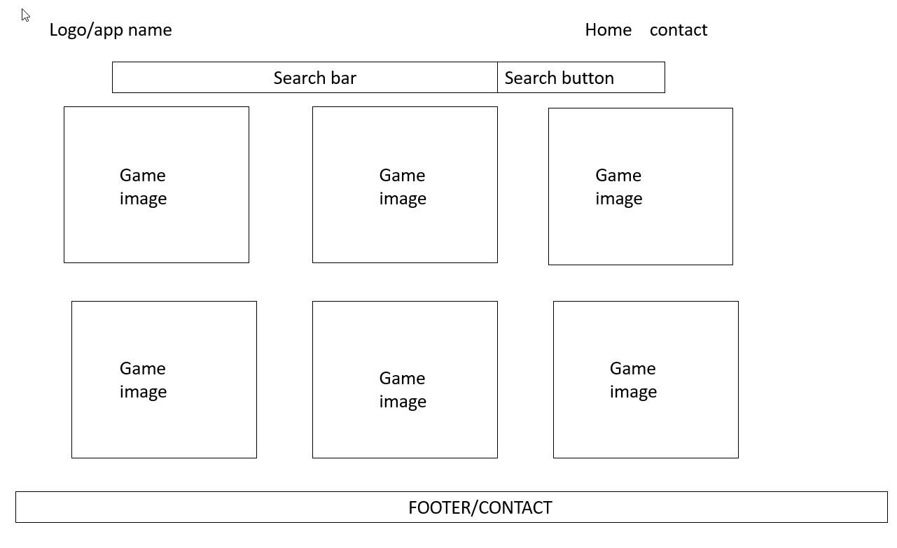
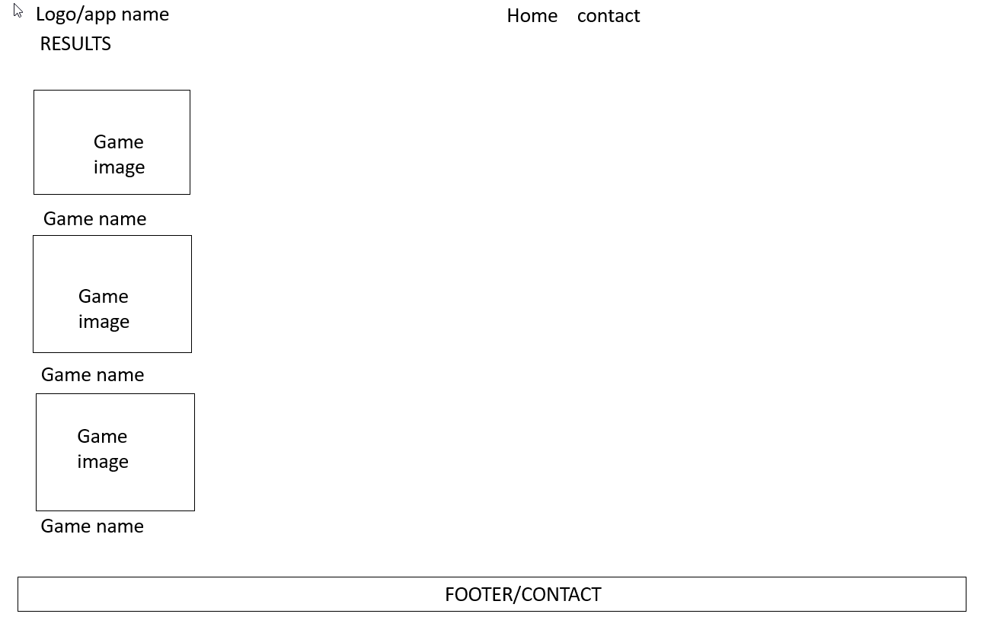
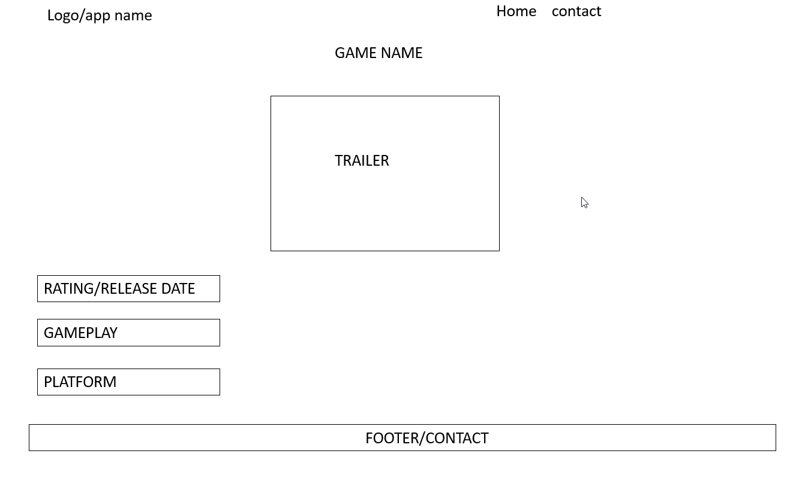
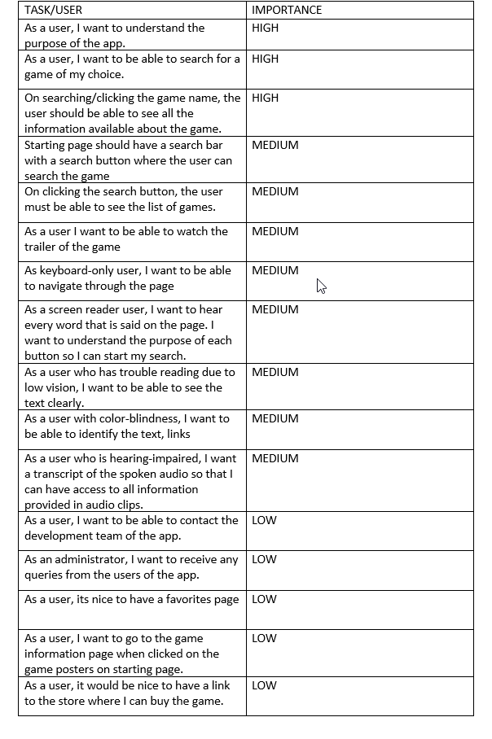
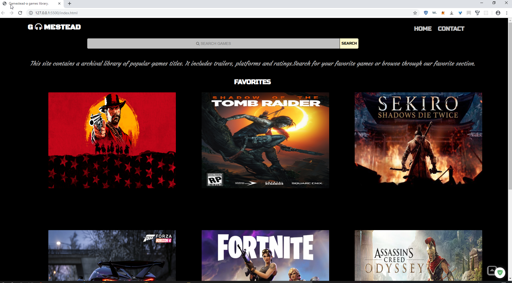
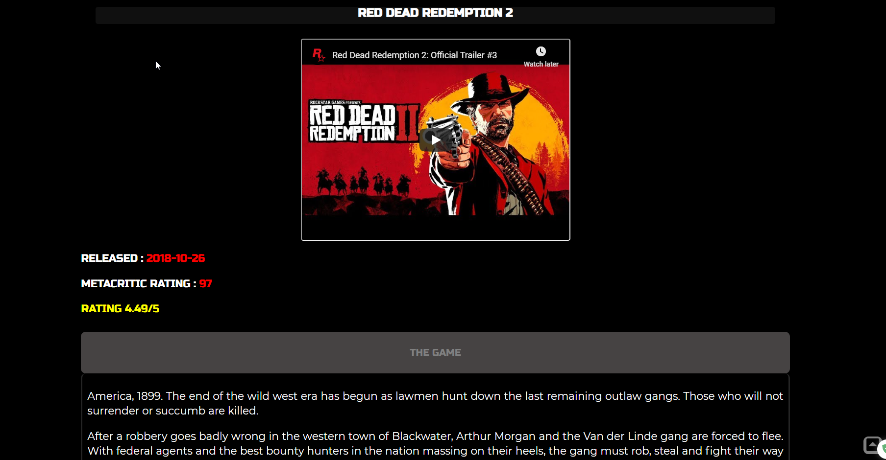
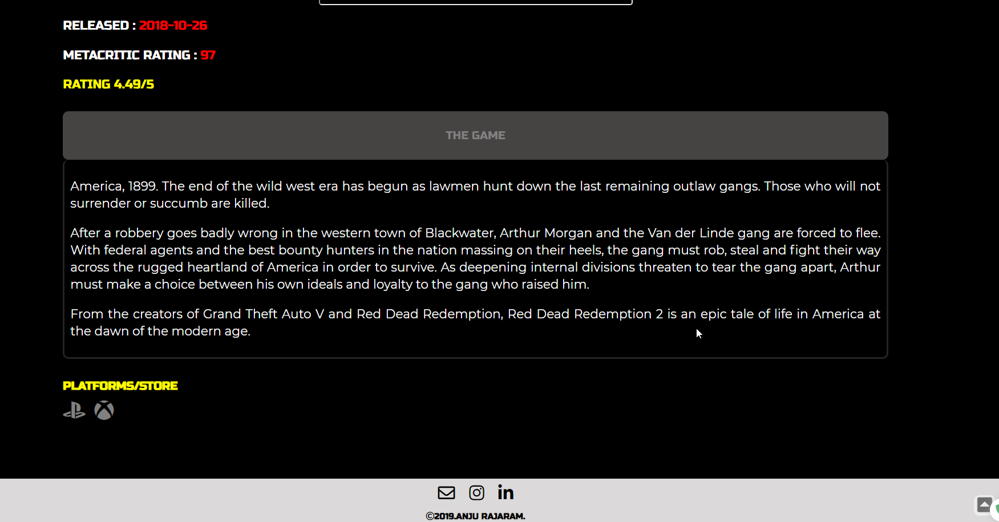
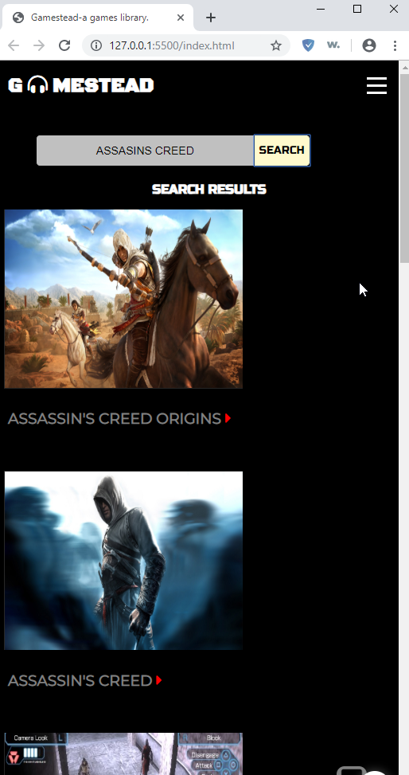
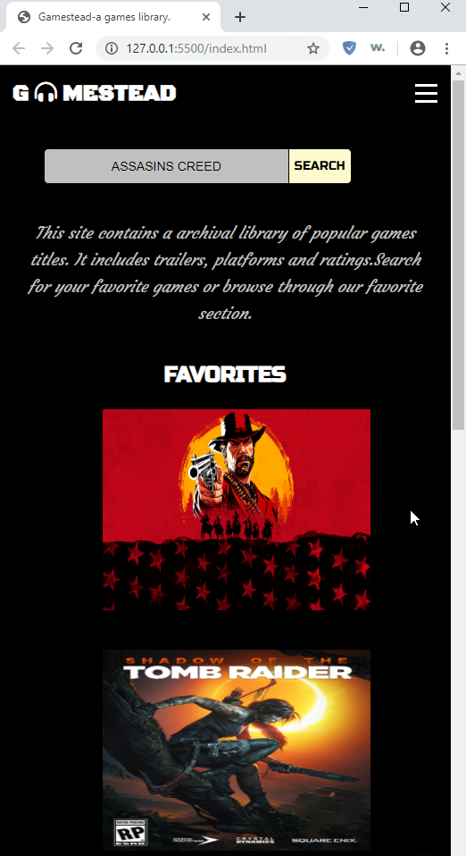

A games library app created using HTML,CSS and JQuery
APIs used- rawg.io api and youtube api

# GAMESTEAD

An app created for anyone who wants to know more about games.The app will let the user to search for a game and be able to watch
the trailer ,get the rating and watch trailers of their favourite games.

### live site: https://anjurajrm.github.io/Gamestead/

## USER FLOWS AND BACK OF NAPKIN :

#### USER FLOW

#### BACK OF NAPKIN DESIGN

## USER STORIES

## PAGE DESIGNS /SCREENSHOTS

## TECHNOLOGIES

- HTML
- CSS
- JAVASCRIPT
- JQUERY

## RESPONSIVE

The App is made to be responsive to screen sizes starting from 320px(small mobile devices).

## SUMMARY

Gamestead is a responsive web app which contains a library of games. Created using HTML,CSS and Jquery where the users can watch trailers ,get ratings of their their favourite games.

## DEVELOPMENT ROAD MAP

- A sign-in form for the users
- A forum for the users
- Contact form
- List of top rated games
- Game search by category
